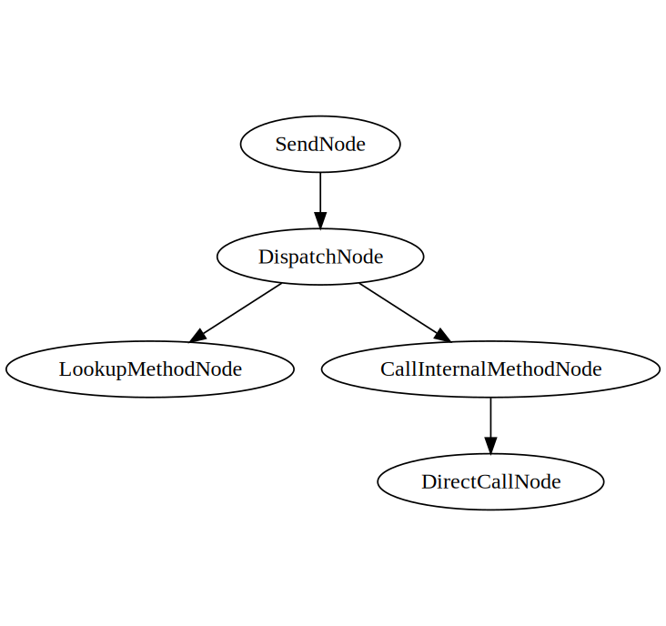

## Intro

In Ruby, practically everything is an object- an instance of a class containing some data, interacting through sending or receiving messages (via method calls). Unlike statically typed languages, wherein one knows at compile time what the set of messages an object can respond to (i.e. what methods are defined on a class), Ruby provides an extensive suite of ways of extending and modifying this set at run time.

As a consequence of this paradigm, Ruby must look up the method instructions you wish to invoke every time that you request to call a method by name, which is a costly operation involving traversing the object’s ancestry to ascertain if and where the method itself can be executed from. In the interest of performance, this process is sped up by caching the results of these lookups and removing the need for redundant work.

In most implementations of Ruby, this is done via inline caching. Historically, this is done in CRuby/MRI through the use of a “global method state (number)” and a “class serial number”. As shown in Aaron Patterson's [article on in inline caching in MRI](https://tenderlovemaking.com/2015/12/23/inline-caching-in-mri.html), the global method state is a global serial number that gets incremented whenever class definitions are mutated. The class serial number is a number derived from the class of whichever object is receiving a method call at a specific call site. This can be illustrated by running the following Ruby code (before Ruby 3+, as things work a little differently there):

```
p RubyVM.stat

module Kernel
  def monkey_patched_method
  end
end

p RubyVM.stat
# Notice that global_method_state is incremented at this point

class A
end

p RubyVM.stat
# Class serial will have increased once by now

class B
end

p RubyVM.stat
# Class serial will have increased twice by now
```

We should see something like

```
{:global_method_state=>133, :global_constant_state=>904, :class_serial=>6329}
{:global_method_state=>134, :global_constant_state=>904, :class_serial=>6329}
{:global_method_state=>134, :global_constant_state=>905, :class_serial=>6331}
{:global_method_state=>134, :global_constant_state=>906, :class_serial=>6333}
```

Furthermore, Aaron points out that in CRuby (<3.1) the cache is rather limited, storing exactly one key-value pair  per _call site_ (code invocation location), and then proceeds to present several situations which are failed by the existing caching mechanism. We see that even when a change to a class is small and localized, the change to global method state and class serials could blow out unrelated caches and slow down performance.

## Polymorphic Inline Caches & Dispatch Chains

This is where [(polymorphic) inline caches](https://en.wikipedia.org/wiki/Inline_caching) and [dispatch chaining](https://chrisseaton.com/truffleruby/pldi15-metaprogramming/pldi15-marr-et-al-zero-overhead-metaprogramming.pdf) come in.

Let's start with an inline cache; a small cache included *inline* (traditionally alongside a call site for a method) that removes the need for redundant method lookup work.



The cache described above could be described as monomorphic; it fares best when dealing with call sites that only see one (mono) type used, rather than some small number n > 1 (a polymorphic site) or such a large number of variations that it wouldn't be reasonable to cache and look up entries (a megamorphic site).


A polymorphic inline cache expands on this by supporting matching on multiple keys (where key is a like a class or name, or _generalized_ to a set of properties such as class *and* name) to yield multiple call sites.



A dispatch chain further expands this model of caching & guarding on complex operations by constructing a tree of polymorphic inline caches so that advanced dispatch decisions can be made, in order to support Ruby's complex object model and expressive metaprogramming system. For example, a `send` can have a tree that first dispatches on
- the method name,
- then on the class,
- then on the bytecode or machine code that represents the returned method, in order to execute code.



However, a notable downside of said tree model is that memory use from constructing caches can quickly expand as the tree gets wider and wider at subsequent levels of branching decisions.

TruffleRuby further develops on this idea by constructing a series of decision trees, with the output of each (polymorphic cache) going as input to the next. This means that if one decision tree produces the same value from multiple branches, the next decision tree sees them as the same value, instead of having a new copy of the tree (and all potential decisions cascading from that point) for the repeated values.



This is particularly useful because it means that we aren't as afraid to add more levels of decision trees and granular caches as memory use isn't expected to increase exponentially. As a result, rather than having one PIC responsible for the caching of a complex process (such as method invocation), a dispatch chain is made up of several PICs with separate concerns and unique cache keys. This both improves the likelihood of breaking down a previously mega/poly site to a poly/mono site and mitigates the consequences of having a megamorphic site's cache blowout cascade through the entire chain of operations being performed.

Let's explore how the use of dispatch chains speeds up method invocation in TruffleRuby, a high-speed JIT-compiled Ruby on top of the GraalVM and the Truffle DSL.

## TruffleRuby’s Method Invocation Mechanism

> First, a quick disclaimer; TruffleRuby makes heavy use of indirection and abstraction within its codebase, which can detract from the exploratory process and overwhelm readers. I’ve simplified and hand-waved away details that aren’t pertinent, but have linked to the source code for the curious.

Let's kick off the method invocation pipeline via

```
# Object o
o.send :foo_method
o.foo_method
```

This will kick off the method invocation process via a [SendNode](https://github.com/oracle/truffleruby/blob/e2f62b89b80cf1d9334dca4d31ef8e379a8712c5/src/main/java/org/truffleruby/core/basicobject/BasicObjectNodes.java#L584-L595), which defers to several other nodes for supporting functionality. Like all Truffle DSL languages, TruffleRuby uses nodes and an AST for its intermediate representation.

Within the send node, we defer to an instantiated-and-stored [DispatchNode](https://github.com/oracle/truffleruby/blob/f9ab0cf8b658bdb6b8a68880556c0b072a2e11a1/src/main/java/org/truffleruby/language/dispatch/DispatchNode.java) responsible for handling lookup and subsequent execution from a call site effectively.

```
protected DispatchNode(
        MetaClassNode metaclassNode,
        LookupMethodNode methodLookup,
        CallInternalMethodNode callNode) {
    this.metaclassNode = metaclassNode;
    this.methodLookup = methodLookup;
    this.callNode = callNode;
}
```

Among other things, the dispatch node contains a [LookupMethodNode](https://github.com/oracle/truffleruby/blob/75d3da3737ff43c906086aaaf349b09360b10bda/src/main/java/org/truffleruby/language/methods/LookupMethodNode.java) and [CallInternalMethodNode](https://github.com/oracle/truffleruby/blob/83e0079d6f9edc96a252a59d794cd1b6af8d7ca3/src/main/java/org/truffleruby/language/methods/CallInternalMethodNode.java), separating the mechanisms responsible for retrieving a method on a class and calling it, respectively.

Here is what this part of the AST "looks" like:


Let’s explore `LookupMethodNode` first:

```
class LookupMethodNode

    cache :meta_class, :name
    cache "lookup_method(cached_meta_class, cached_name)", as: :method_lookup_result
    limit :get_cache_limit
    guard_on :cached_meta_class, :cached_name
    def lookup_method_cached(meta_class, name)
        return method_lookup_result
    end
end
```

Simplified from:

```
@Specialization(
        guards = {
                "isSingleContext()",
                "metaClass == cachedMetaClass",
                "name == cachedName",
                "config == cachedConfig" },
        assumptions = "methodLookupResult.getAssumptions()",
        limit = "getCacheLimit()")
protected InternalMethod lookupMethodCached(
        Frame frame, RubyClass metaClass, String name, DispatchConfiguration config,
        @Cached("metaClass") RubyClass cachedMetaClass,
        @Cached("name") String cachedName,
        @Cached("config") DispatchConfiguration cachedConfig,
        @Cached("lookupCached(getContext(), frame, cachedMetaClass, cachedName, config)") MethodLookupResult methodLookupResult) {

    return methodLookupResult.getMethod();
}
```

We've encountered our first generalized PIC in the dispatch chain! Caching on the `metaClass` (essentially the class of the object) and the `name` of the method being passed in, this node takes a Ruby class and method name to look up, and pops out an `InternalMethod` object. Note that this stores up to `getCacheLimit()` entries, which is why it is a _poly_ morphic cache.

Next, let's examine `CallInternalMethodNode`, which is passed the lookup node’s `InternalMethod` result:

```
final InternalMethod method = lookupMethodNode.execute(frame, metaclass, methodName, config);

/*
 * Cut out implementationdetails
 */

return callNode.execute(frame, method, receiver, rubyArgs, literalCallNode);
```

Simplified once again:

```
class CallInternalMethodNode

    cache :method
    cache "method.get_call_target", as: :call_target
    cache "create_call(cached_method.get_name, cached_call_target)", as: :call_node
    guard_on :cached_call_target, "!cached_method.always_inlined?"
    limit :get_cache_limit
    def call_cached(method, *method_args)
        # Note how the call node is generated and cached as part of the cache entry from a cached method and cached call target.
        # As long as the guards are not violated, all of this is stored in the poly cache and invoked speedily.
        call_node.call(call_target, method_args)
    end
end
```

From:

```
@Specialization(
        guards = {
                "isSingleContext()",
                "method.getCallTarget() == cachedCallTarget",
                "!cachedMethod.alwaysInlined()" },
        assumptions = "getMethodAssumption(cachedMethod)", // to remove the inline cache entry when the method is redefined or removed
        limit = "getCacheLimit()")
protected Object callCached(
        InternalMethod method, Object receiver, Object[] rubyArgs, LiteralCallNode literalCallNode,
        @Cached("method.getCallTarget()") RootCallTarget cachedCallTarget,
        @Cached("method") InternalMethod cachedMethod,
        @Cached("createCall(cachedMethod.getName(), cachedCallTarget)") DirectCallNode callNode) {
    if (literalCallNode != null) {
        literalCallNode.copyRuby2KeywordsHash(rubyArgs, cachedMethod.getSharedMethodInfo());
    }

    return callNode.call(RubyArguments.repackForCall(rubyArgs));
}
```

As a result, we're able to sequence these PICs so that the processes of converting a call site to a method lookup and the method execution are cached separately & based on unique properties relevant to the data flow at each process.
## What can we take away from it all?

TruffleRuby uses this advanced and complex/compound design of inline caching because it tackles some of the dynamic nature of Ruby. For example, complex class hierarchies methods that are aliased with different names can result in a call to the same code, and our technique means we can de-duplicate that call and ensure speedy execution of interpreted _and_ JITted code.

Currently, we're using these techniques to optimise conventional Ruby and especially metaprogramming in powerful ways. We think we can use their power and flexibility to address other Ruby idioms that aren't currently well-optimised, such as extensive use of singletons to define per-object methods. At the moment these trip up the VM as they cause the first layer of caching to become megamorphic. Our ongoing work is looking at adding another level of indirection and further specializing on top of the dispatch system to accommodate for singleton classes, ensuring that idiomatic & expressive Ruby continues to be performant.

## Special Thanks
Thanks to [Chris Seaton](https://chrisseaton.com/), [Kevin Menard](https://nirvdrum.com/), [Kevin Newton](https://kddnewton.com/), and [Kaan Ozkan](https://twitter.com/Kaan0zkan) for looking over and providing feedback on early drafts of mine, and to [Aaron Patterson](https://tenderlovemaking.com/) for the MRI caching crash course.
